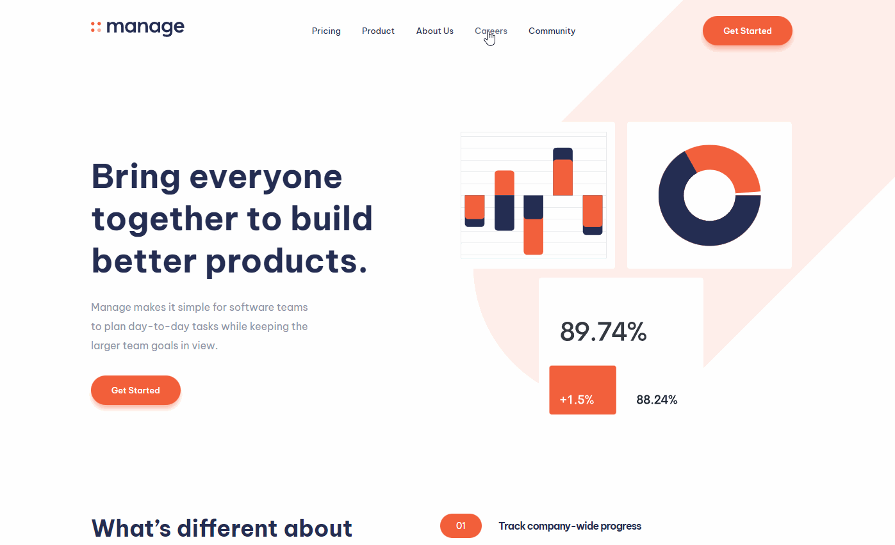

# Frontend Mentor - Manage landing page solution

This is a solution to the [Manage landing page challenge on Frontend Mentor](https://www.frontendmentor.io/challenges/manage-landing-page-SLXqC6P5). Frontend Mentor challenges help you improve your coding skills by building realistic projects. 

## Table of contents

- [Overview](#overview)
  - [The challenge](#the-challenge)
  - [Preview](#preview)
  - [Links](#links)
- [Build with](#built-with)
- [Author](#author)

## Overview

### The challenge

Users should be able to:

- View the optimal layout for the site depending on their device's screen size
- See hover states for all interactive elements on the page
- See all testimonials in a horizontal slider
- Receive an error message when the newsletter sign up `form` is submitted if:
  - The `input` field is empty
  - The email address is not formatted correctly

### Preview

Desktop Preview

Mobile Preview

### Links

- Solution URL: [https://www.frontendmentor.io/challenges/manage-landing-page-SLXqC6P5/hub/solution-created-with-sass-and-has-a-working-slideshow-on-mobile-AHuVvD1FUq](https://www.frontendmentor.io/challenges/manage-landing-page-SLXqC6P5/hub/solution-created-with-sass-and-has-a-working-slideshow-on-mobile-AHuVvD1FUq)
- Live Site URL: [https://justcode11.github.io/manage-landing-page/](https://justcode11.github.io/manage-landing-page/)

### Built with

- Semantic HTML5 markup
- Sass
- Flexbox
- CSS Grid

## Author

- Frontend Mentor - [@JustCode11](https://www.frontendmentor.io/profile/JustCode11)
